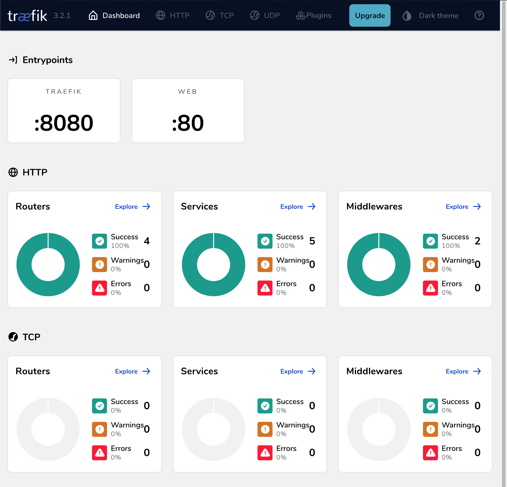
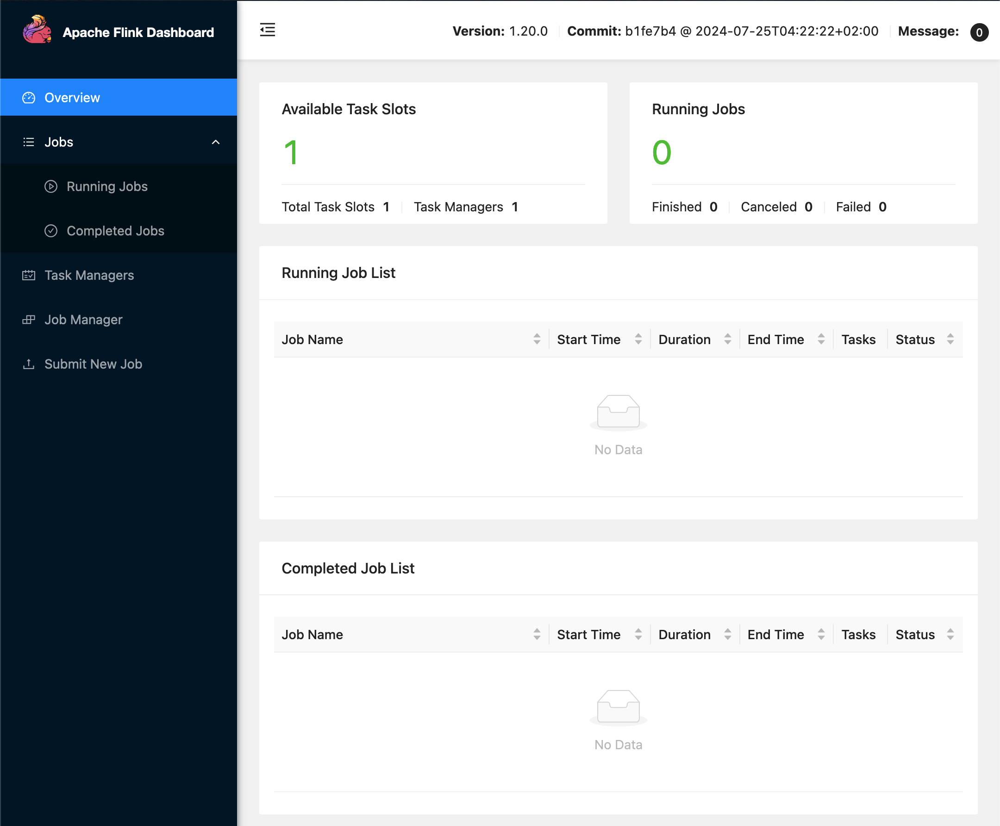
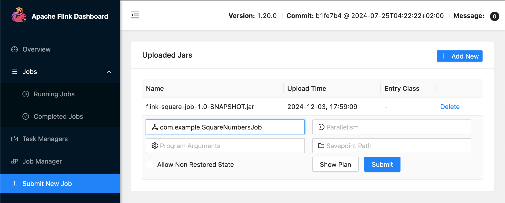

# local-env-flink

## Description

This project uses [Docker Compose](https://docs.docker.com/compose/) to spin up a local [Flink](https://flink.apache.org/) cluster for development purposes.

It is *not* intended for use in production.

## License

MIT licensed. See [LICENSE.txt](./LICENSE.txt) for more details.

## Prerequisites

- [Docker Desktop](https://www.docker.com/products/docker-desktop/)
- [OpenJDK/Java 17](https://learn.microsoft.com/en-us/java/openjdk/download#openjdk-17) (used by the Flink example)
- [Gradle](https://gradle.org/) (used by the Flink example)

## Getting Started

1. Add the following entry to your `/etc/hosts` file.

    ```hosts.txt
    # Host mappings for local-env-flink
    127.0.0.1 traefik.localhost
    127.0.0.1 flink.localhost
    ```

2. Start the Docker Compose services: `docker compose up --detach`

3. (Optional) Navigate to the Traefik Dashboard at [http://traefik.localhost](http://traefik.localhost).

    

4. (Optional) Navigate to the Flink dashboard at [http://flink.localhost](http://flink.localhost).

    

## Building the Flink Example

To build the example Flink job:

```console
# Change to the example directory
mike@laptop:~$ cd flink-example-job

# Run gradle
mike@laptop:~$ gradle clean build
Starting a Gradle Daemon (subsequent builds will be faster)

BUILD SUCCESSFUL in 6s
6 actionable tasks: 6 executed
```

The Gradle build will create a Flink job JAR file at `flink-example-job/build/libs/flink-square-job-1.0-SNAPSHOT.jar` which you can load into the Flink environment using the job uploader page in the Flink Dashboard.


